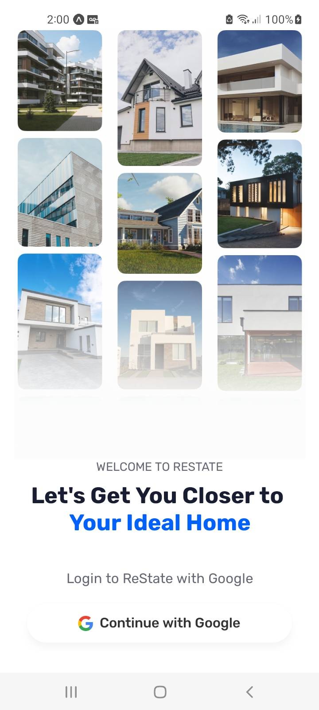
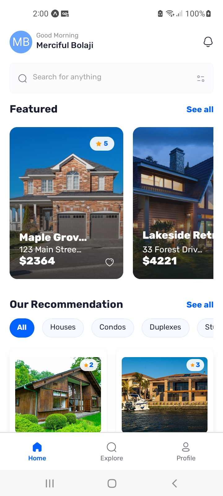
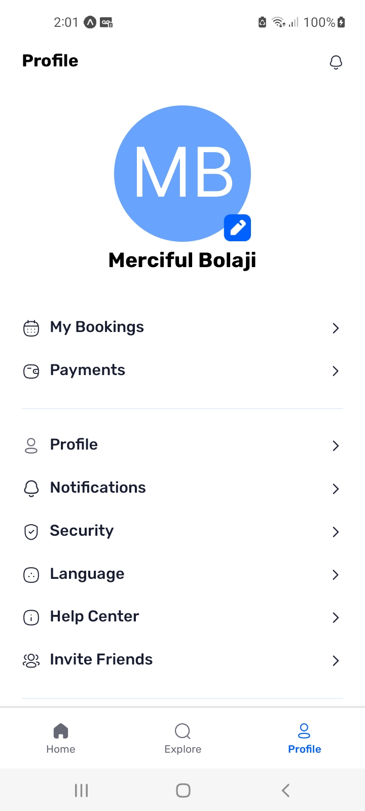
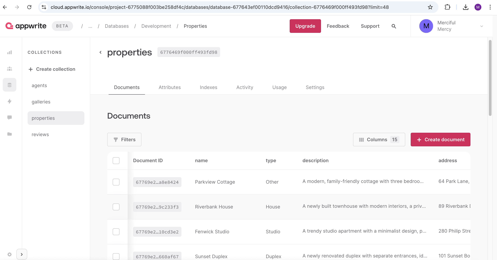

This is an [Expo](https://expo.dev) project created with [`create-expo-app`](https://www.npmjs.com/package/create-expo-app).
# Real Estate App 🏡

A full-stack Real Estate application built with **React Native**, **Expo SDK 52**, and **TypeScript**, featuring Google authentication, dynamic property listings, and customizable user profiles. Designed with modern tools like **Appwrite**, **Tailwind CSS**, and **Nativewind**, this app prioritizes scalability, efficient data fetching, and clean architecture for an exceptional user experience. 🚀

---

## ✨ Features

- 🔑 **Google Authentication**: Secure and seamless user sign-ins using Google.
- 🏠 **Home Page**: Discover the latest and recommended properties with advanced search and filter functionality.
- 🔍 **Explore Page**: Browse properties in a clean, user-friendly interface.
- 📄 **Property Details Page**: View comprehensive property information, including images, features, and pricing.
- 👤 **Profile Page**: Customizable user settings and profile management.
- ⚡ **Centralized Data Fetching**: Inspired by TanStack’s `useQuery`, enabling efficient API calls.
- 📱 **Optimized for Mobile**: A responsive and performant app leveraging React Native and Expo.

---

## 🛠️ Tech Stack

| Tool/Framework   | Description                                   |
|-------------------|-----------------------------------------------|
| **React Native**  | Framework for building cross-platform apps.  |
| **Expo SDK 52**   | Development platform for React Native apps.  |
| **TypeScript**    | Statically typed JavaScript for scalability. |
| **Appwrite**      | Backend-as-a-service for authentication and database management. |
| **Tailwind CSS**  | Utility-first CSS framework for styling.     |
| **Nativewind**    | Tailwind CSS for React Native.               |

---

## 📸 Screenshots

| Feature         | Screenshot                                  |
|------------------|---------------------------------------------|
| **Sign In Page**    |        |
| **Home Page**    |        |
| **Explore Page** |  |
| **Property Page**|  |
| **AppWrit Database**|  |

---

## 🚀 Installation & Setup

1. **Clone the Repository**:
   ```bash
   git clone https://github.com/your-username/Real-Estate-App.git
   cd Real-Estate-App
